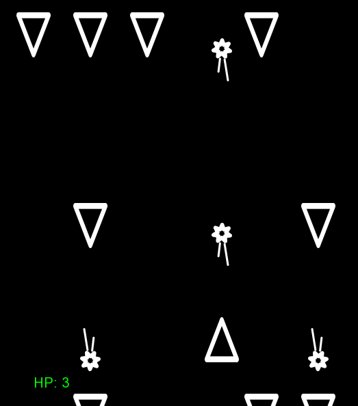

# Project
A 2D "Shoot-em-up" / "shmup" style game in C++ using SFML graphics library:
https://en.wikipedia.org/wiki/Shoot_%27em_up
Project was designed in an object-oriented style.
Game systems (e.g. input & graphics management) were designed to be easily scalable and largely independent of each other, as well as external libraries used.
Object pooling system was implemented to lower possible cpu demand.

Basic class documentation & overview is provided in the docs directory.

# Play
Player steers a "ship" (triangle pointing upwards) left / right using arrow keys.
Enemy "ships" (triangles pointing down) spawn from the top of the screen and move towards the player.
All "ships" shoot projectiles automatically at regular intervals.
The goal is to avoid enemy projectiles while destroying enemy "ships".
After 3 collisions with enemy "ships" or projectiles, the game is over.



# Compilation
To recompile project, you will need to link statically SFML library (2.5.1+, *not* included in project).
To do that, change the below paths in the Makefile file, with accordance to your install directory:
```
SFINC="include folder path"
SFLIB="lib folder path"
```
After that, simply run make in project dir (compiled with g++).